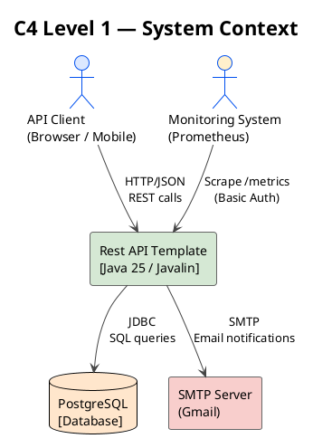
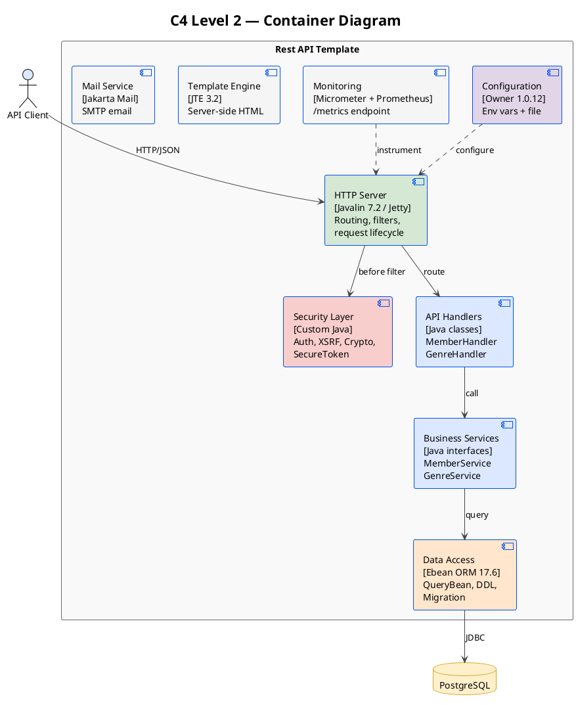
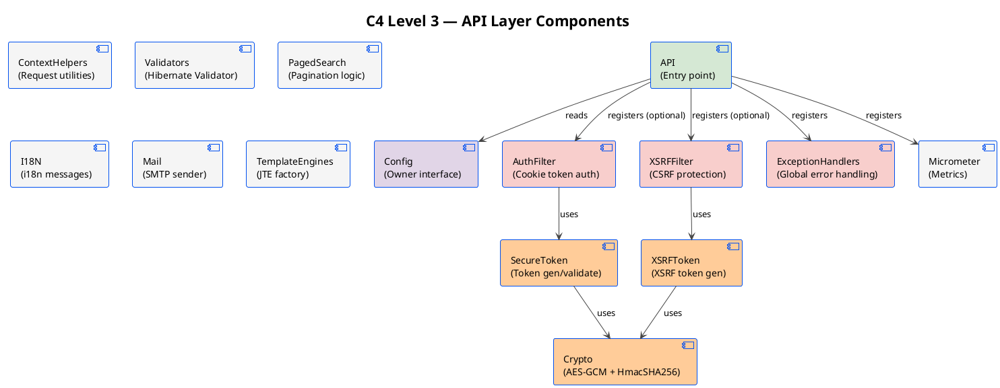
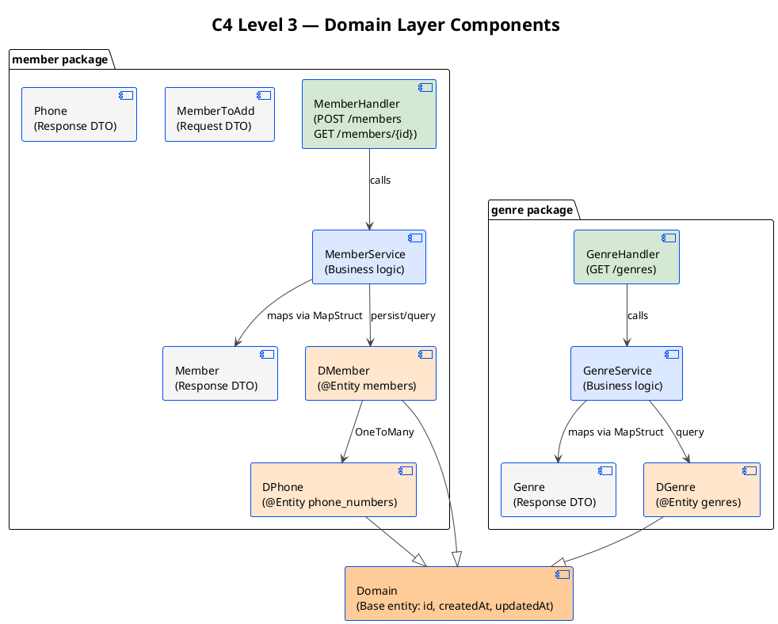
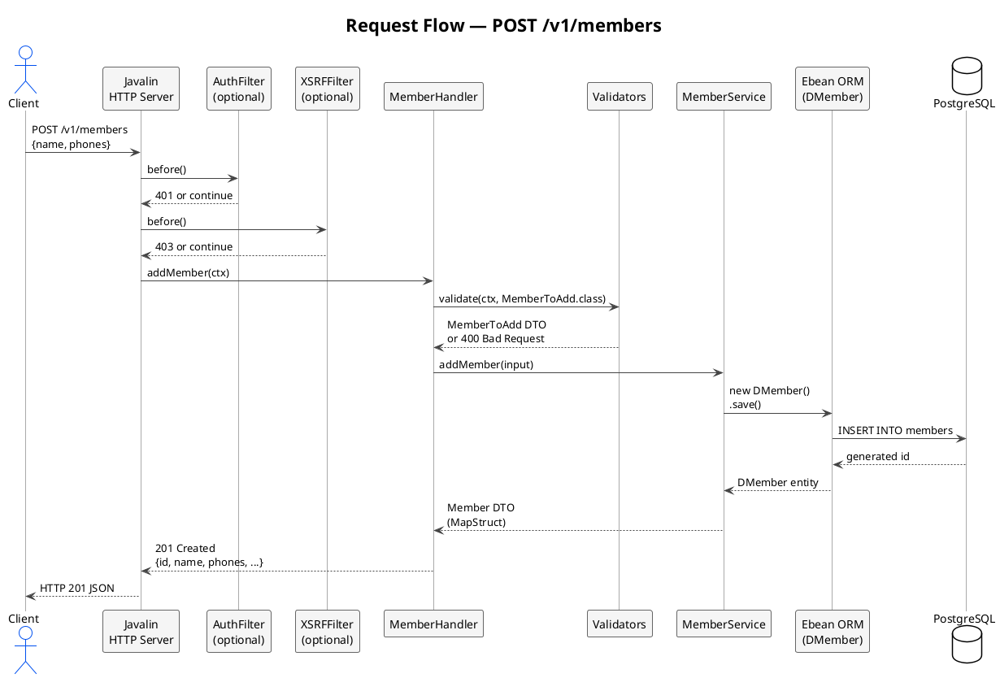
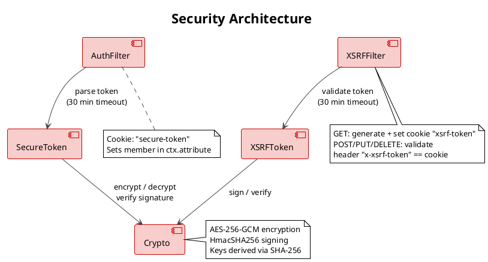
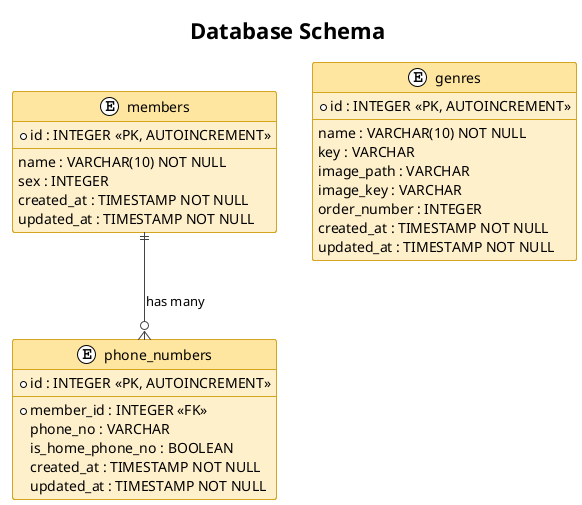
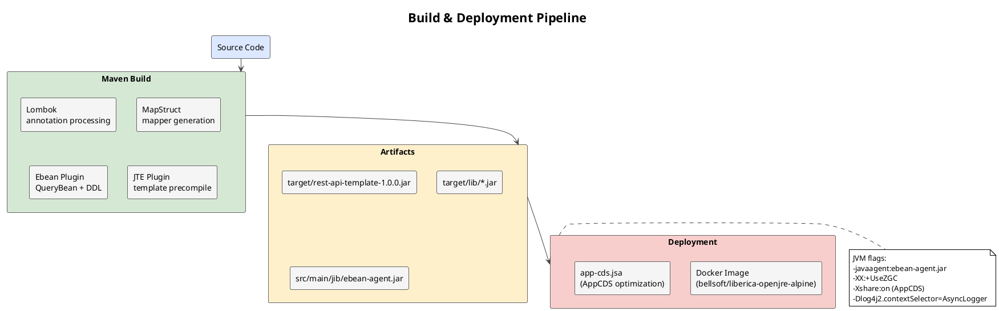

# Rest API Template — Architecture Documentation

> **Диаграм харах:** `Ctrl+Shift+V` → Markdown Preview Enhanced  
> **PlantUML тусдаа харах:** `.puml` файл дотор `Alt+D`

---

## Table of Contents

1. [Overview](#overview)
2. [C4 Level 1 — System Context](#c4-level-1--system-context)
3. [C4 Level 2 — Container](#c4-level-2--container)
4. [C4 Level 3 — Component (API Layer)](#c4-level-3--component-api-layer)
5. [C4 Level 3 — Component (Domain Layer)](#c4-level-3--component-domain-layer)
6. [Request Flow](#request-flow)
7. [Security Architecture](#security-architecture)
8. [Database Schema](#database-schema)
9. [Package Structure](#package-structure)
10. [Technology Stack](#technology-stack)
11. [API Endpoints](#api-endpoints)
12. [Build & Deployment](#build--deployment)
13. [Testing Strategy](#testing-strategy)

---

## Overview

`rest-api-template` нь **Javalin + Ebean + PostgreSQL** дээр суурилсан layered REST API template.

| Зүйл | Утга |
|------|------|
| Group ID | `batzorigt.rentsen` |
| Artifact ID | `rest-api-template` |
| Version | `1.0.0` |
| Java | 25 |
| Context path | `/v1/` |
| Default port | `8080` |

---

## C4 Level 1 — System Context

Системийн хамгийн дээд түвшний дүр зураг.



---

## C4 Level 2 — Container

Системийн дотоод container-уудыг харуулна.



---

## C4 Level 3 — Component (API Layer)

`rest.api` package-ийн бүрэлдэхүүн хэсгүүд.



---

## C4 Level 3 — Component (Domain Layer)

`member` болон `genre` package-ийн бүрэлдэхүүн хэсгүүд.



---

## Request Flow

HTTP хүсэлтийн дамжих замыг харуулна.



---

## Security Architecture



### Security Headers (every response)

| Header | Value |
|--------|-------|
| `Strict-Transport-Security` | `max-age=63072000; includeSubDomains; preload` |
| `X-Frame-Options` | `DENY` |
| `X-Content-Type-Options` | `nosniff` |
| `Content-Security-Policy` | `frame-ancestors 'none'; default-src 'self'` |
| `Cache-Control` | `no-store` |
| `X-XSS-Protection` | `1; mode=block` |
| `Referrer-Policy` | `no-referrer` |
| `Cross-Origin-Resource-Policy` | `same-origin` |

---

## Database Schema



---

## Package Structure

```
src/
├── main/
│   ├── java/rest/api/
│   │   ├── API.java                  # Entry point, Javalin config
│   │   ├── Config.java               # Configuration interface (Owner)
│   │   ├── Domain.java               # Base entity (id, createdAt, updatedAt)
│   │   ├── AuthFilter.java           # Cookie-based auth filter
│   │   ├── XSRFFilter.java           # CSRF filter (cookie + header)
│   │   ├── XSRFToken.java            # XSRF token generator/validator
│   │   ├── SecureToken.java          # Encrypted secure token
│   │   ├── Crypto.java               # AES-GCM + HmacSHA256
│   │   ├── Base64.java               # URL-safe Base64
│   │   ├── ContextAttributes.java    # Context attribute key constants
│   │   ├── ContextHelpers.java       # HTTP request/response utilities
│   │   ├── Validators.java           # Jakarta Bean Validation
│   │   ├── ExceptionHandlers.java    # Global exception handlers
│   │   ├── PagedData.java            # Pagination response wrapper
│   │   ├── PagedSearch.java          # Pagination query logic
│   │   ├── NumberHelpers.java        # Numeric utilities
│   │   ├── I18N.java                 # Internationalization (ja / en)
│   │   ├── IO.java                   # File/classpath read utilities
│   │   ├── Mail.java                 # Jakarta Mail SMTP sender
│   │   ├── TemplateEngines.java      # JTE engine factory
│   │   ├── Micrometer.java           # Prometheus metrics setup
│   │   ├── GenerateDbMigration.java  # DDL migration generator (dev only)
│   │   │
│   │   ├── member/                   # Member feature
│   │   │   ├── DMember.java          # @Entity → members table
│   │   │   ├── DPhone.java           # @Entity → phone_numbers table
│   │   │   ├── Member.java           # Response DTO + MapStruct Convertor
│   │   │   ├── Phone.java            # Response DTO
│   │   │   ├── MemberToAdd.java      # Request DTO
│   │   │   ├── MemberHandler.java    # Route handler
│   │   │   └── MemberService.java    # Business logic
│   │   │
│   │   └── genre/                    # Genre feature
│   │       ├── DGenre.java           # @Entity → genres table
│   │       ├── Genre.java            # Response DTO + MapStruct Convertor
│   │       ├── GenreHandler.java     # Route handler
│   │       └── GenreService.java     # Business logic
│   │
│   ├── resources/
│   │   ├── application.properties    # Datasource config
│   │   ├── i18n.properties           # English messages
│   │   ├── i18n_ja.properties        # Japanese messages
│   │   ├── log4j2.xml                # Logging config
│   │   ├── jte/                      # JTE templates
│   │   └── dbmigration/              # Generated SQL migrations
│   │
│   └── jib/
│       ├── ebean-agent-17.6.0.jar    # Ebean bytecode agent
│       ├── log4j2.xml                # Docker logging config
│       └── jte-classes/              # Precompiled JTE templates
│
└── test/
    ├── java/rest/api/
    │   ├── genre/                    # Genre tests
    │   ├── member/                   # Member tests
    │   ├── CryptoTest.java
    │   ├── I18NTest.java
    │   ├── PagedSearchTest.java
    │   └── ...
    └── resources/
        ├── application.properties    # Test DB config (Testcontainers)
        └── ...
```

---

## Technology Stack

| Category | Library | Version | Purpose |
|----------|---------|---------|---------|
| Web Framework | Javalin | 7.2.0 | HTTP server, routing |
| Web Server | Jetty | (bundled) | Embedded servlet container |
| ORM | Ebean | 17.6.0 | Database access, QueryBean |
| DB Driver | PostgreSQL JDBC | 42.7.11 | PostgreSQL connectivity |
| DB Migration | Ebean Migration | 14.3.0 | Schema versioning |
| Validation | Hibernate Validator | 9.1.0 | Bean validation (JSR-380) |
| DTO Mapping | MapStruct | 1.6.3 | Entity ↔ DTO conversion |
| Configuration | Owner | 1.0.12 | Externalized config |
| Templates | JTE | 3.2.4 | Server-side HTML |
| Logging | Log4j2 | 2.26.0 | Async structured logging |
| Async Logging | LMAX Disruptor | 4.0.0 | Lock-free async log queue |
| Monitoring | Micrometer | 1.16.5 | Prometheus metrics |
| Mail | Jakarta Mail | 2.1.5 | SMTP email |
| JSON | Jackson | 2.21.3 | JSON serialization |
| JSON | org.json | 20251224 | JSON object building |
| Mobile Detect | mobiledetect | 1.1.1 | User-agent parsing |
| Utils | Commons Lang3 | 3.20.0 | String utilities |
| Utils | Commons Collections4 | 4.5.0 | Collection utilities |
| Code Gen | Lombok | 1.18.46 | Getters/Setters/Builders |
| Testing | JUnit 5 | 6.0.3 | Unit testing |
| Testing | Mockito | 5.23.0 | Mocking |
| Testing | JMockit | 1.50 | Alternative mocking |
| Testing | Ebean Test | 17.6.0 | DB testing support |
| Testing | Testcontainers | (via Ebean) | Docker-based DB tests |
| Testing | Unirest | 3.14.5 | HTTP client for tests |

---

## API Endpoints

| Method | Path | Description | Transaction |
|--------|------|-------------|-------------|
| `GET` | `/v1/genres` | Genre жагсаалт (pagination) | `readOnly` |
| `GET` | `/v1/members/{id}` | Member ID-р хайх | `readOnly` |
| `POST` | `/v1/members` | Member үүсгэх | `readWrite` |
| `GET` | `/v1/metrics` | Prometheus metrics | — |

### Pagination Query Params

| Param | Type | Description |
|-------|------|-------------|
| `pageNumber` | `Integer` | Хуудасны дугаар (1-based) |
| `recordsPerPage` | `Integer` | Нэг хуудасны мөрийн тоо |

### Error Responses

| Status | Тайлбар |
|--------|---------|
| `400` | Validation алдаа — field-level JSON errors |
| `401` | Auth token байхгүй/хугацаа дууссан |
| `403` | XSRF token буруу |
| `404` | Өгөгдөл олдсонгүй |
| `500` | Системийн алдаа |

---

## Build & Deployment



### Quick Start

```bash
# Build
mvn package            # или
build.bat              # Windows (AppCDS хамт)

# Run
run.bat                # Windows (optimal JVM flags)
run.sh                 # Linux/macOS

# Docker
docker build --format docker -t rest-api-template .
docker run -p 8080:8080 \
  -e DB_HOST_NAME=host.docker.internal \
  -e DB_PASSWORD=password \
  rest-api-template
```

---

## Testing Strategy

| Давхарга | Хэрэгсэл | Тайлбар |
|---------|---------|---------|
| Unit tests | JUnit 5 + Mockito | Service, utility class тест |
| Integration tests | JUnit 5 + Ebean Test | DB-тэй хамт тест |
| Container tests | Testcontainers | Docker PostgreSQL дээр |
| HTTP tests | Unirest | API endpoint тест |
| Mocking | Mockito / JMockit | External dependency isolation |

Test DB тохиргоо (`src/test/resources/application.properties`):

```properties
ebean.test.platform   = postgres
ebean.test.port       = 6433
ebean.test.ddlMode    = dropCreate
ebean.test.dbName     = test
ebean.test.useDocker  = true
```

---

## Configuration Reference

| Property | Default | Тайлбар |
|----------|---------|---------|
| `portNo` | `8080` | Server port |
| `contextPath` | `/v1/` | API root path |
| `allowedOrigins` | `localhost:8080,4200,4201` | CORS |
| `encryptionKey` | `1234567890123456` | AES key (≥16 chars) |
| `xsrfProtectionEnabled` | `false` | XSRF filter идэвхжүүлэх |
| `isSecure` | `false` | HTTPS cookie flag |
| `httpMaxRequestSize` | `1024` | Max request bytes |
| `httpAsyncTimeout` | `5000` | Async timeout ms |
| `monitoringUsername` | `micro` | Metrics basic auth |
| `monitoringPassword` | `meter` | Metrics basic auth |
| `environment` | `local` | `local` = JTE dev mode |
| `smtpHost` | `smtp.gmail.com` | Mail server |
| `smtpPort` | `587` | Mail port |
