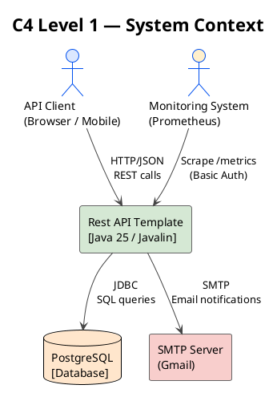
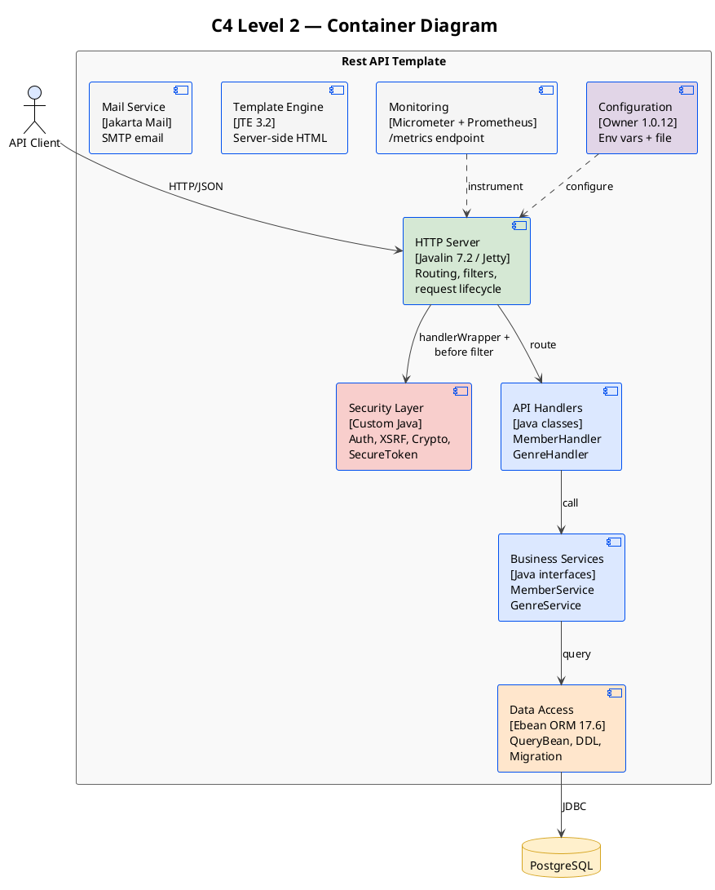
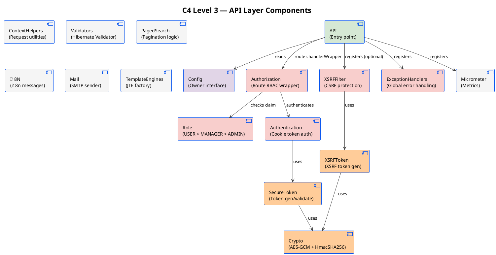
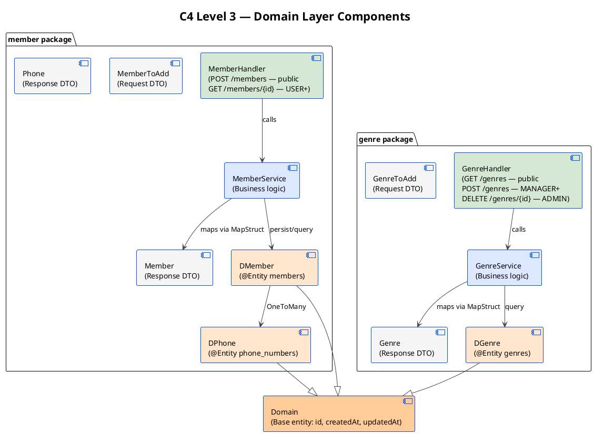
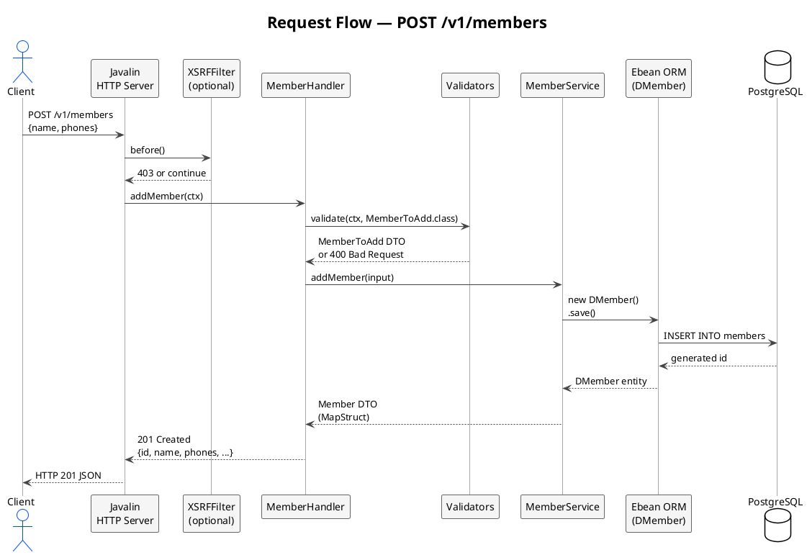
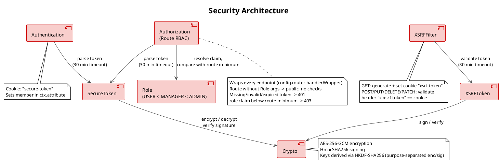
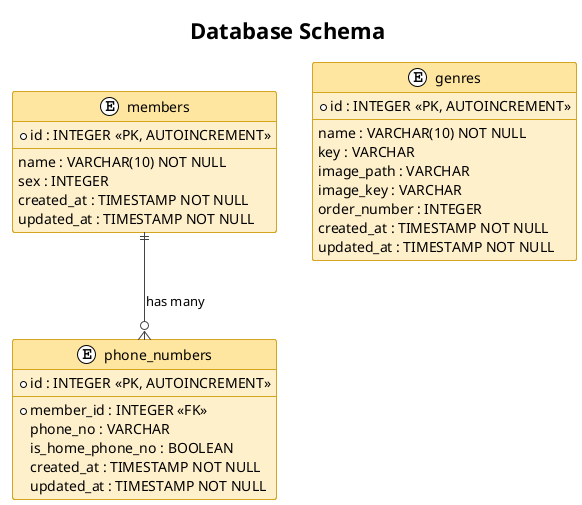
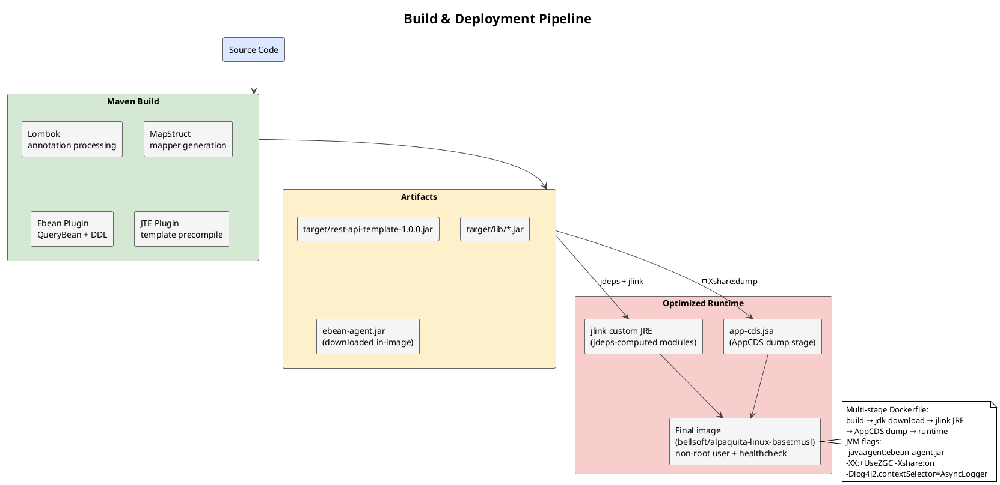

# Rest API Template — Architecture Documentation

> **Preview diagrams:** `Ctrl+Shift+V` (Markdown Preview Enhanced) · PlantUML: `Alt+D` inside `.puml` files

---

## Table of Contents

1. [Overview](#overview)
2. [C4 Level 1 — System Context](#c4-level-1--system-context)
3. [C4 Level 2 — Container](#c4-level-2--container)
4. [C4 Level 3 — Component (API Layer)](#c4-level-3--component-api-layer)
5. [C4 Level 3 — Component (Domain Layer)](#c4-level-3--component-domain-layer)
6. [Request Flow](#request-flow)
7. [Security Architecture](#security-architecture)
8. [Database Schema](#database-schema)
9. [Package Structure](#package-structure)
10. [Technology Stack](#technology-stack)
11. [API Endpoints](#api-endpoints)
12. [Build & Deployment](#build--deployment)
13. [Testing Strategy](#testing-strategy)

---

## Overview

Layered REST API template built on **Javalin + Ebean + PostgreSQL**.

| Item         | Value               |
|--------------|---------------------|
| Group ID     | `batzorigt.rentsen` |
| Artifact ID  | `rest-api-template` |
| Version      | `1.0.0`             |
| Java         | `25`                |
| Context path | `/v1/`              |
| Default port | `8080`              |

---

## C4 Level 1 — System Context

Highest-level system view.



---

## C4 Level 2 — Container

Internal containers of the system.



---

## C4 Level 3 — Component (API Layer)

Components of the `rest.api` package.



---

## C4 Level 3 — Component (Domain Layer)

Components of the `member` and `genre` packages.



---

## Request Flow

Path of an HTTP request through the system.



Role-protected routes (`Role.*` args) pass through `Authorization` before the
handler runs: it authenticates the `secure-token` cookie (401 on
missing/invalid/expired) and compares the payload's `role` claim with the route
minimum (403 when insufficient). Public routes skip this step entirely.

---

## Security Architecture



### Security Headers (every response)

| Header | Value |
|--------|-------|
| `Strict-Transport-Security` | `max-age=63072000; includeSubDomains; preload` |
| `X-Frame-Options` | `DENY` |
| `X-Content-Type-Options` | `nosniff` |
| `Content-Security-Policy` | `frame-ancestors 'none'; default-src 'self' style-src 'self' 'unsafe-inline';` |
| `Cache-Control` | `no-store` |
| `X-XSS-Protection` | `1; mode=block` |
| `Referrer-Policy` | `no-referrer` |
| `Cross-Origin-Resource-Policy` | `same-origin` |
| `Feature-Policy` | `none` |

### Authorization (RBAC)

`rest.api.Authorization` wraps every endpoint via `config.router.handlerWrapper(Authorization::wrap)` and enforces the roles declared on the route.

- **Role hierarchy:** `USER(0) < MANAGER(10) < ADMIN(20)` — user level must be ≥ the route minimum.
- **Role source:** `role` claim in the `secure-token` cookie's JSON payload (`rest.api.Role.claim`); missing/unknown → `USER`.
- **Public routes:** no role args = public, no checks.
- **Responses:** missing/invalid/expired token → `401`; insufficient role → `403`.

Current route matrix:

| Route | Minimum role |
|-------|--------------|
| `POST /v1/members` | public (registration) |
| `GET /v1/members/{id}` | `USER` (any authenticated) |
| `GET /v1/genres` | public |
| `POST /v1/genres` | `MANAGER` |
| `DELETE /v1/genres/{id}` | `ADMIN` |

---

## Database Schema



---

## Package Structure

```
src/
├── main/
│   ├── java/rest/api/
│   │   ├── API.java                  # Entry point, Javalin config
│   │   ├── Config.java               # Configuration interface (Owner)
│   │   ├── Domain.java               # Base entity (id, createdAt, updatedAt)
│   │   ├── Authorization.java        # Route RBAC wrapper (handlerWrapper)
│   │   ├── Role.java                 # Role enum: USER < MANAGER < ADMIN
│   │   ├── Authentication.java       # Cookie-based auth filter
│   │   ├── XSRFFilter.java           # CSRF filter (cookie + header)
│   │   ├── XSRFToken.java            # XSRF token generator/validator
│   │   ├── SecureToken.java          # Encrypted secure token
│   │   ├── Crypto.java               # AES-GCM + HmacSHA256
│   │   ├── Base64.java               # URL-safe Base64
│   │   ├── ContextAttributes.java    # Context attribute key constants
│   │   ├── ContextHelpers.java       # HTTP request/response utilities
│   │   ├── Validators.java           # Jakarta Bean Validation
│   │   ├── ExceptionHandlers.java    # Global exception handlers
│   │   ├── PagedData.java            # Pagination response wrapper
│   │   ├── PagedSearch.java          # Pagination query logic
│   │   ├── NumberHelpers.java        # Numeric utilities
│   │   ├── I18N.java                 # Internationalization (Japanese-only bundle)
│   │   ├── IO.java                   # File/classpath read utilities
│   │   ├── Mail.java                 # Jakarta Mail SMTP sender
│   │   ├── TemplateEngines.java      # JTE engine factory
│   │   ├── Micrometer.java           # Prometheus metrics setup
│   │   ├── GenerateDbMigration.java  # DDL migration generator (dev only)
│   │   │
│   │   ├── member/                   # Member feature
│   │   │   ├── DMember.java          # @Entity → members table
│   │   │   ├── DPhone.java           # @Entity → phone_numbers table
│   │   │   ├── Member.java           # Response DTO + MapStruct Convertor
│   │   │   ├── Phone.java            # Response DTO
│   │   │   ├── MemberToAdd.java      # Request DTO
│   │   │   ├── MemberHandler.java    # Route handler
│   │   │   ├── MemberService.java    # Business logic
│   │   │   └── query/                # Generated QueryBeans (QDMember)
│   │   │
│   │   └── genre/                    # Genre feature
│   │       ├── DGenre.java           # @Entity → genres table
│   │       ├── Genre.java            # Response DTO + MapStruct Convertor
│   │       ├── GenreToAdd.java       # Request DTO (POST /genres)
│   │       ├── GenreHandler.java     # Route handler
│   │       ├── GenreService.java     # Business logic
│   │       └── query/                # Generated QueryBeans (QDGenre)
│   │
│   │
│   ├── resources/
│   │   ├── application.properties    # Maven-filtered datasource config (DB_* env placeholders)
│   │   ├── i18n_ja.properties        # Messages — Japanese is the ONLY shipped bundle
│   │   ├── log4j2.xml                # Logging config
│   │   ├── jte/                      # JTE templates (hello.jte)
│   │   └── dbmigration/              # Generated SQL migrations (created on demand by GenerateDbMigration)
│   │
│   └── jib/
│       ├── ebean-agent-17.6.0.jar    # Ebean bytecode agent
│       ├── log4j2.xml                # Docker logging config
│       └── jte-classes/              # Precompiled JTE templates
│
└── test/
    ├── java/rest/api/
    │   ├── AuthorizationTest.java   # RBAC 401/403/allow matrix (HTTP)
    │   ├── RoleTest.java            # Role hierarchy + parse unit tests
    │   ├── SecureTokenTest.java     # Token gen/parse/expiry
    │   ├── XSRFTokenTest.java       # XSRF token sign/validate
    │   ├── CryptoTest.java          # AES-GCM encrypt/decrypt/sign
    │   ├── AppConfigTest.java       # Owner config loading
    │   ├── ContextHelpersTest.java  # Response helpers + query params
    │   ├── PagedDataTest.java       # Pagination wrapper
    │   ├── PagedSearchTest.java     # Paged vs all-data finder logic
    │   ├── I18NTest.java            # i18n message resolution
    │   ├── I18NJapaneseOnlyTest.java# Guards Japanese-only bundle contract
    │   ├── IOTest.java              # Classpath/file read helpers
    │   ├── TemplateEnginesTest.java # JTE dev/precompiled modes
    │   ├── MailTest.java            # SMTP message building
    │   ├── genre/                   # GenreHandlerTest, GenreServiceTest, DGenreTest
    │   └── member/                  # MemberHandlerTest, MemberServiceTest
    └── resources/
        ├── application.properties   # Test DB config (Postgres Testcontainer :6433)
        └── ...                      # i18n bundles for tests, log4j2.xml
```

---

## Technology Stack

| Category | Library | Version | Purpose |
|----------|---------|---------|---------|
| Web Framework | Javalin | 7.2.0 | HTTP server, routing |
| Web Server | Jetty | (bundled) | Embedded servlet container |
| ORM | Ebean | 17.6.0 | Database access, QueryBean |
| DB Driver | PostgreSQL JDBC | 42.7.11 | PostgreSQL connectivity |
| DB Migration | Ebean Migration | 14.3.0 | Schema versioning |
| Validation | Hibernate Validator | 9.1.0.Final | Bean validation (JSR-380) |
| DTO Mapping | MapStruct | 1.6.3 | Entity ↔ DTO conversion |
| Configuration | Owner | 1.0.12 | Externalized config |
| Templates | JTE | 3.2.4 | Server-side HTML |
| Logging Facade | SLF4J | 2.0.17 | API used by Javalin/Ebean |
| Logging | Log4j2 | 2.26.0 | Async structured logging |
| Async Logging | LMAX Disruptor | 4.0.0 | Lock-free async log queue |
| Monitoring | Micrometer | 1.16.5 | Prometheus metrics |
| Mail API | Jakarta Mail | 2.1.5 | SMTP email API |
| Mail Provider | Angus Mail | 2.0.5 | Jakarta Mail implementation |
| JSON | Jackson | 2.21.3 | JSON serialization |
| JSON | org.json | 20251224 | JSON object building |
| Mobile Detect | mobiledetect | 1.1.1 | User-agent parsing |
| Utils | Commons Lang3 | 3.20.0 | String utilities |
| Utils | Commons Collections4 | 4.5.0 | Collection utilities |
| Code Gen | Lombok | 1.18.46 | Getters/Setters/Builders |
| Testing | JUnit Jupiter | 6.0.3 | Unit testing |
| Testing | Mockito | 5.23.0 | Mocking |
| Testing | JMockit | 1.50 | Alternative mocking |
| Testing | Ebean Test | 17.6.0 | DB testing support |
| Testing | Testcontainers | (via Ebean) | Docker-based DB tests |
| Testing | Unirest | 3.14.5 | HTTP client for tests |

---

## API Endpoints

| Method | Path | Description | Transaction | Roles |
|--------|------|-------------|-------------|-------|
| `GET` | `/v1/genres` | List genres (paginated) | `readOnly` | public |
| `POST` | `/v1/genres` | Add genre | `readWrite` | `MANAGER+` |
| `DELETE` | `/v1/genres/{id}` | Delete genre | `readWrite` | `ADMIN` |
| `GET` | `/v1/members/{id}` | Find member by ID | `readOnly` | `USER+` (authenticated) |
| `POST` | `/v1/members` | Create member (registration) | `readWrite` | public |
| `GET` | `/v1/metrics` | Prometheus metrics | — | Basic auth (monitoring) |

Roles column = minimum role enforced by the `Authorization` wrapper (`USER < MANAGER < ADMIN`, higher satisfies lower). Missing/invalid token → `401` on role-guarded routes.

### Pagination Query Params

| Param | Type | Description |
|-------|------|-------------|
| `pageNumber` | `Integer` | Page number (1-based); invalid/non-positive → `400` |
| `recordsPerPage` | `Integer` | Rows per page, capped at `10`; invalid/non-positive → `400`. Only when both params are absent does the endpoint return all rows |

> ⚠️ **Warning:** a param-less `GET` calls AllDataFinder. When writing an AllDataFinder, consider whether pulling every row fits memory; latency/DoS risk. Each such fetch logs a runtime `WARN` (`PagedSearch`). Production clients should always pass pagination params.
>
> To forbid full fetch, pass `null` as the `allDataFinder` argument of `PagedSearch.search(...)` — unpaginated calls then get `403 Forbidden` («Find all is not allowed!»).

### Error Responses

| Status | Description |
|--------|-------------|
| `400` | Validation error — field-level JSON errors |
| `401` | Missing/invalid/expired `secure-token` (role-guarded routes) |
| `403` | Invalid XSRF token **or** insufficient role (RBAC) |
| `404` | Data not found |
| `500` | Internal system error |

---

## Build & Deployment



### Quick Start

```bash
# Build
mvn package            # or
build.bat              # Windows (includes AppCDS)

# Run
run.bat                # Windows (optimal JVM flags)
run.sh                 # Linux/macOS

# Docker
docker build -t rest-api-template .          # docker
podman build --format docker -t rest-api-template .   # podman (--format is a podman flag)
docker run -p 8080:8080 \
  -e DB_HOST_NAME=host.docker.internal \
  -e DB_PASSWORD=password \
  rest-api-template
```

---

## Testing Strategy

| Layer | Tooling | Notes |
|---------|---------|---------|
| Unit tests | JUnit 5 + Mockito | Service/utility tests (`RoleTest`, etc.) |
| Integration tests | JUnit 5 + Ebean Test | Tests against a real DB |
| Container tests | Testcontainers | Dockerized PostgreSQL |
| HTTP tests | Unirest | API endpoint tests (`AuthorizationTest` — RBAC 401/403/allow matrix) |
| Mocking | Mockito / JMockit | External dependency isolation |

Test DB config (`src/test/resources/application.properties`):

```properties
ebean.test.platform   = postgres
ebean.test.port       = 6433
ebean.test.ddlMode    = dropCreate
ebean.test.dbName     = test
ebean.test.useDocker  = true
```

---

## Configuration Reference

| Property | Default | Description |
|----------|---------|-------------|
| `portNo` | `8080` | Server port |
| `contextPath` | `/v1/` | API root path |
| `allowedOrigins` | `http://localhost:8080, http://localhost:4200, http://localhost:4201, http://batzorigt.com:4200` | CORS allow-host list |
| `encryptionKey` | `1234567890123456` | AES key (≥16 chars) |
| `xsrfProtectionEnabled` | `false` | Enable the XSRF filter |
| `isSecure` | `false` | HTTPS cookie flag |
| `httpMaxRequestSize` | `1024` | Max request bytes |
| `httpAsyncTimeout` | `5000` | Async timeout ms |
| `requestLoggingEnabled` | `false` | HTTP request log via Javalin's native request logger (method/path/status/duration; no headers or bodies). Silence per environment with log4j2: `<Logger name="rest.api.RequestLogger" level="warn"/>` |
| `requestLoggingVerbose` | `false` | Adds safe headers, `REDACTED(len=N)` for Cookie/Authorization, and body size to the HTTP log — token and body contents are never logged |
| `monitoringUsername` | `micro` | Metrics basic auth |
| `monitoringPassword` | `meter` | Metrics basic auth |
| `environment` | `local` | `local` = JTE dev mode + dev logging; non-local refuses the default encryptionKey at startup |
| `jteClassesDir` | `jte-classes` | Precompiled JTE class dir |
| `smtpHost` | `smtp.gmail.com` | Mail server |
| `smtpPort` | `587` | Mail port |
| `smtpUsername` | `any@email.address` | SMTP auth user |
| `smtpPassword` | `anypassword` | SMTP auth password |
| `smtpAuth` | `true` | SMTP auth on/off |
| `smtpStartTls` | `true` | STARTTLS on/off |
